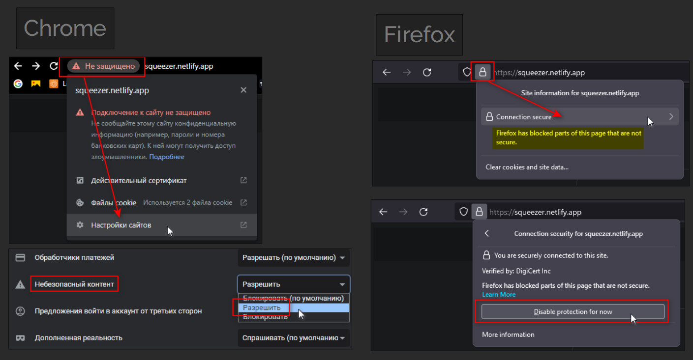

Тестовое задание на взаимодействие с бекендом, который генерирует короткие ссылки.

Развернутый проект можно найти здесь:
https://squeezer.netlify.app/

Так как бекенд работает через протокол http и браузеры блокируют небезопасные запросы, нужно разрешить передачу в настройках сайта:
 

Если пользователь не авторизован, то сервер отдает статистику по всем пользователям - я не стал это блокировать.

Условия задания:
Frontend может состоять из нескольких страниц (главное наличие функциональности):
  - Страница регистрации
  - Страница авторизации
  - Основная страница, реализующая следующую функциональность:
    
      - Просмотр статистики по созданным ссылкам в виде таблицы
      - Таблица содержит минимум три столбца - короткая ссылка, исходная ссылка, количество переходов по короткой ссылке
      - Таблица должна иметь пагинацию, работающую на стороне сервера
      - Таблица должна иметь возможность сортировки по столбцам

Интерактивная документация по API расположена по адресу http://79.143.31.216/docs

Бонсом будет: 
 - Возможность фильтрации по нескольким столбцам таблицы статистики одновременно 
 - Копирование сокращенных ссылок при клике 
 - Запуск через docker контейнер 
 - Развернутый сервер с Вашим кодом в сети (Требуется указать ссылку в readme.md) 
    
